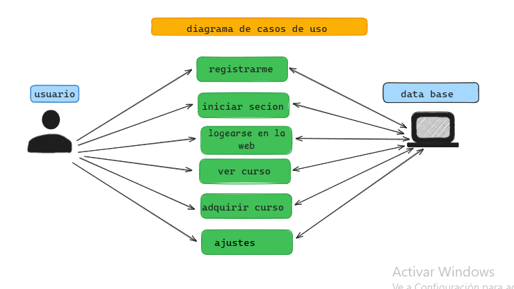

Ed.Experte_Quechua
# Título: ED.EXPERT
 
Fuente: https://edexpert.my.canva.site/
# problematica
La falta de acceso a recursos educativos en quechua, la desconexión entre comunidades quechuahablantes y la complejidad de la lengua quechua limitan la capacidad de los estudiantes para aprender y conectar con la cultura.
# solucion
Nuestra web de educación en quechua ofrece una plataforma integral para aprender y compartir la lengua y cultura quechua.
Preservar y promover la lengua y cultura quechua, conectando a comunidades, ciudades y facilitando el aprendizaje para todas las edades..
# casos de uso

# mvp (formulario)
La fuente que emos utilizado para crear nuestra mvp 
es el formulario de (google forms) el cual tambien nos permite medir nuestro mvp.
 -> https://docs.google.com/forms/d/e/1FAIpQLSfHyOjIp8ZqLIP8Yxjd9eYROFldk-JCcF9ajmU3awtbvVny2A/viewform?usp=sf_link
 
 
Descripción: ED.EXPERT es un sitio web que ofrece cursos online de quechua. El sitio web presenta una interfaz simple y atractiva, con información clara sobre los cursos ofrecidos.
 
Puntos Clave:
 
- Cursos de Quechua: ED.EXPERT ofrece cursos de quechua en tres niveles: básico, intermedio y avanzado.
- Información Detallada: Cada curso incluye una breve descripción, el nivel de dificultad y el horario.
- Inscripción: El sitio web permite a los usuarios matricularse en los cursos.
- Información de Contacto: El sitio web proporciona información de contacto para aquellos que deseen obtener más información sobre los cursos.
 
Fenómenos:
 
- El sitio web utiliza un diseño atractivo y fácil de navegar.
- La información sobre los cursos es clara y concisa.
- El sitio web está diseñado para facilitar la inscripción en los cursos.
 
Conclusión:
 
ED.EXPERT es un sitio web útil para aquellos que desean aprender quechua. El sitio web ofrece una variedad de cursos en diferentes niveles, con información detallada y un proceso de inscripción sencillo.

enlase de nuestro landing page 
https://edexpert.my.canva.site/ 